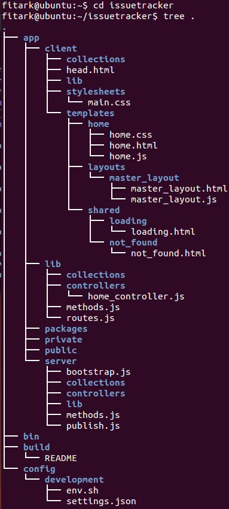
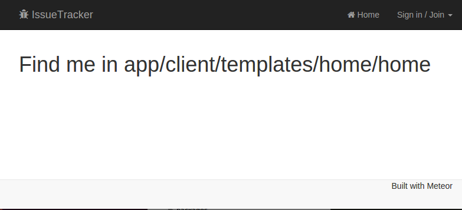
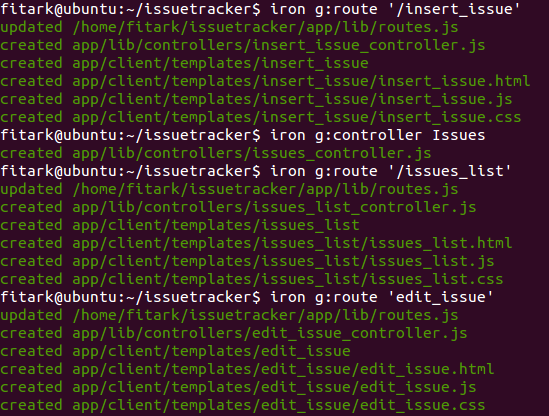
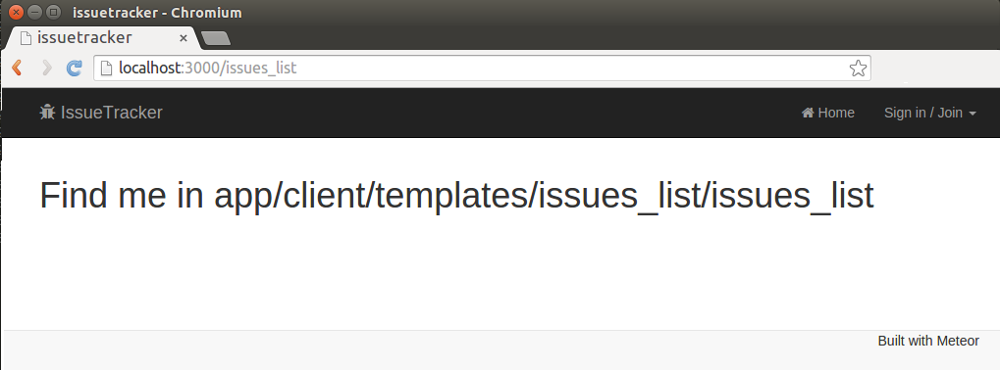
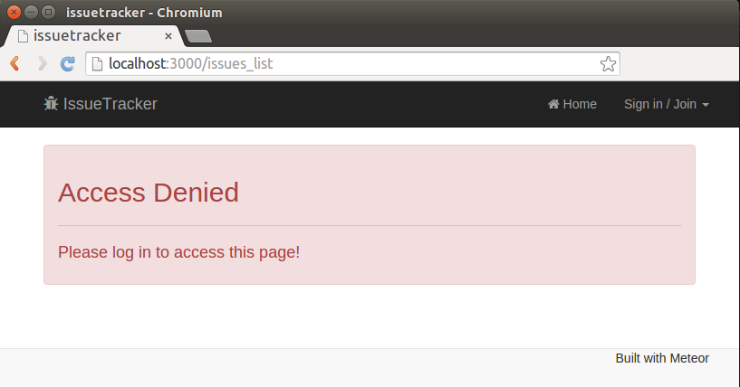
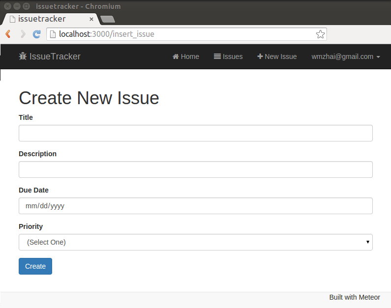
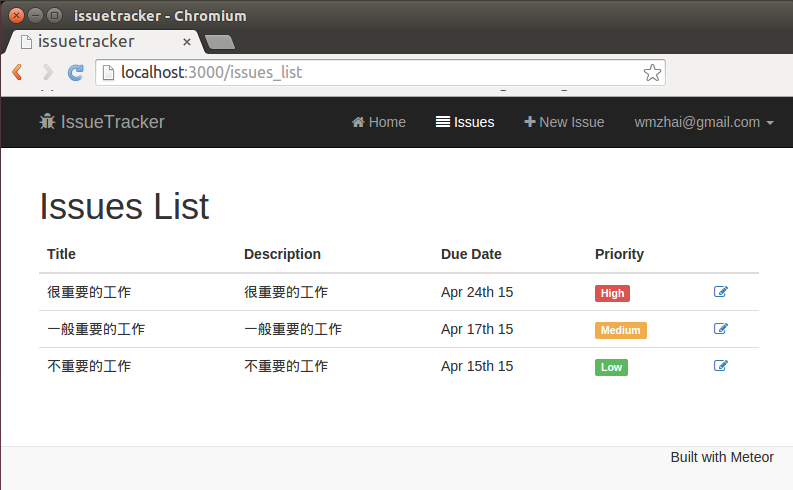
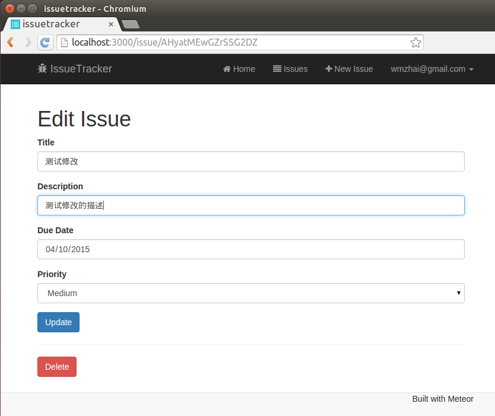

# 使用Iron工具快速搭建Meteor程序

采用Meteor框架搭建现代的web应用很快很方便，不过如果你使用iron scaffolding脚手架工具和autoforms工具包的话，这个过程会更加快捷，这个例子就展示了如何一步一步地新建一个程序。

##1. 安装Meteor和Iron工具

使用如下两个指令分别安装meteor和iron

	$ curl http://install.meteor.com/ |sh
	$ npm install -g iron-meteor
	

##2. 新建程序

使用如下指令创建一个叫做issuetracker的程序

	$ iron create issuetracker

这个脚手架工具将创建一个新的issuetracker目录，这时可以进入如图1所示目录看一下目录结构，meteor程序在app子目录里。

图1 新建程序的目录结构

##3. 安装新的package

可以通过下述指令添加一些常规的meteor package，我们将在项目中使用

	$iron add twbs:bootstrap
	$iron add aldeed:collection2
	$iron add aldeed:autoform
	$iron add aldeed:delete-button
	$iron add momentjs:moment
	$iron add accounts-password
	$iron add ian:accounts-ui-bootstrap-3
	$iron add natestrauser:font-awesome

然后再通过下属指令删除2个不使用的package

	$iron remove autopublish
	$iron remove insecure

这是如果打开app/.meteor/packages文件的话，应该可以看到如下package

	meteor-platform
	iron:router
	twbs:bootstrap
	aldeed:collection2
	aldeed:autoform
	aldeed:delete-button
	momentjs:moment
	accounts-password
	ian:accounts-ui-bootstrap-3
	natestrauser:font-awesome

##4. 添加数据模型

本项目管理issue的跟踪，只涉及到一个数据模型issue。在meteor中，数据被表述称collections，下述iron指令可以用于添加一个名叫issue的collection

	iron g:collection issues

这条指令实际上生成一个文件
	
	app/lib/collections/issues.js

打开这个文件，修改成如下内容

	Issues = new Mongo.Collection('issues');
	
	Issues.attachSchema(new SimpleSchema({
	  title:{
	    type: String,
	    label: "Title",
	    max: 100
	  },
	  description:{
	    type: String,
	    label: "Description",
	    max: 1024
	  },
	  dueDate:
	  {
	    type: Date,
	    label: "Due Date",
	    optional: true
	  },
	  priority:
	  {
	    type: String,
	    label: "Priority",
	    allowedValues: ['High', 'Medium', 'Low'],
	    optional: true
	  },
	  createdBy: {
	    type: String,
	    autoValue: function() {
	       return this.userId
	    }
	  }
	}));
	
	if (Meteor.isServer) {
	  Issues.allow({
	    insert: function (userId, doc) {
	      return userId;
	    },
	
	    update: function (userId, doc, fieldNames, modifier) {
	      return userId;
	    },
	
	    remove: function (userId, doc) {
	      return userId;
	    }
	  });
	}

在上述代码中，首先创建了一个Mongo的collection，并将他的引用保存在Issues里。然后，一个collection的schema被attach到这个对象上，用来描述数据库结构。 在这里使用一个SimpleSchema对象，这个对象包含4个字段title, description, dueDate and priority。 对于每一个字段，都定义了一个type和label，最后title和description都定义了max字段来限制字符串的长度。 而priority字段则设置了几个allowedValues作为其值域。

另外，在publish.js文件里面添加如下代码，以便客户端访问特定的数据集。

	Meteor.publish('issues', function (userId) {
	  return Issues.find({createdBy: userId});
	});

这里的publish函数接受一个参数：userId。 这个参数用以限制被发布的对象仅限于创建它的user。

##5. 初始化用户界面

使用bootstrap来初始化用户界面，用户界面整体放在MasterLayout这个模板里，他的代码在如下文件里

	app/client/templates/layouts/master_layout/master_layout.html

其代码如下

	<template name="MasterLayout">
	  <nav class="navbar navbar-inverse navbar-fixed-top" role="navigation">
	    

	      

	          <button type="button" class="navbar-toggle" data-toggle="collapse" data-target="#navigationbar">
	            Toggle navigation
	            
	            
	            
	          </button>
	          <a class="navbar-brand" href="/"><i class="fa fa-bug"></i> IssueTracker</a>
	      

	      

	        <ul class="nav navbar-nav navbar-right">
	            <li>{{#linkTo route="home"}}<i class="fa fa-home"></i> Home{{/linkTo}}</li>
	            {{#if currentUser}}
	              <li>{{#linkTo route="issuesList"}}<i class="fa fa-align-justify"></i> Issues{{/linkTo}}</li>
	              <li>{{#linkTo route="insertIssue"}}<i class="fa fa-plus"></i> New Issue{{/linkTo}}</li>
	            {{/if}}
	            <li>
 {{> loginButtons}}
</li>
	        </ul>
	      

	    

	  </nav>
	  

	    {{> yield}}
	  

	  <nav class="navbar navbar-default navbar-fixed-bottom">
	    

	      <ul class="nav navbar-nav navbar-right">
	          <li>Built with Meteor</li>
	      </ul>
	    

	  </nav>
	</template>

注意，也需要修改一下如下css文件

	app/client/stylesheets/main.css

其代码可以修改为

	.main {
	}
	
	body { padding-top: 70px; padding-bottom: 70px;}

然后运行程序，可以看到如图2所示效果

图2 初始化程序界面

##6. 创建Controller和Route

执行如下指令，创建一个controller

	iron g:controller Issues

生成文件

	app/lib/controllers/issues_controller.js

再执行

	$iron g:route 'insert_issue'
	$iron g:route 'issues_list'
	$iron g:route 'edit_issue'
效果如下

图3 通过iron指令生成route

然后删掉在app/lib/controllers下面多生成的3个文件

	edit_issue_controller.js
	insert_issue_controller.js
	issues_list_controller.js

最后修改app/lib/controllers/issues_controller.js如下

	IssuesController = RouteController.extend({
	  subscriptions: function () {
	    this.subscribe('issues', Meteor.userId());
	  },
	
	  data: function () {
	    return Issues.findOne({_id: this.params._id});
	  },
	
	  insert: function () {
	    this.render('InsertIssue', {});
	  },
	
	  list: function() {
	    this.render('IssuesList', {});
	  },
	
	  edit: function() {
	    this.render('EditIssue', {});
	  }
	});

最后我们修改routes.js如下

	Router.configure({
	  layoutTemplate: 'MasterLayout',
	  loadingTemplate: 'Loading',
	  notFoundTemplate: 'NotFound'
	});
	
	Router.route('/', {
	  name: 'home',
	  controller: 'HomeController',
	  action: 'action',
	  where: 'client'
	});
	
	Router.route('/insert_issue', {
	  name: 'insertIssue',
	  controller: 'IssuesController',
	  action: 'insert',
	  where: 'client'
	});
	
	
	Router.route('issues_list', {
	  name: 'issuesList',
	  controller: 'IssuesController',
	  action: 'list',
	  where: 'client'
	});
	
	Router.route('/issue/:_id', {
	  name: 'editIssue',
	  controller: 'IssuesController',
	  action: 'edit',
	  where: 'client'
	});

这时访问http://localhost:3000/issues_list会有如下显示

图4 访问issues list网页

##7. 对routes进行安全控制

在routes.js加入以下代码以防止非授权的针对InsertIssue和IssuesList的访问

	Router.onBeforeAction(function() {
	  if (!Meteor.user()) {
	    this.render('AccessDenied');
	  } else
	  {
	     this.next();
	  }
	}, {only: ['issuesList', 'insertIssue']});

然后，我们用如下template指令AccessDenied生成页面

	$iron g:template AccessDenied

其中，access_denied.html的内容修改如下

	<template name="AccessDenied">
	  

	    <h2>Access Denied</h2>
	    

	    <h4>Please log in to access this page!</h4>
	  

	</template>

这时候在未登录时访问http://localhost:3000/issues_list会有如下显示

图5 访问issues list网页显示Access Denided

##8. 实现IssuesController

IssuesController在issues_controller.js里实现。首先，我们在subscriptions函数里通过subscribe使用2个参数来从服务器端订阅issues，第一个参数是我们需要订阅的collection的名字'issues',第二个参数是用户的id，这样限制只能获取该用户的issue。 然后，data属性用来获取特定id的数据项，在这里我们使用了findOne函数。 最后3个函数insert, list and edit则分别用来渲染不同的模板。该类代码如下

	IssuesController = RouteController.extend({
	  subscriptions: function () {
	    this.subscribe('issues', Meteor.userId());
	  },
	
	  data: function () {
	    return Issues.findOne({_id: this.params._id});
	  },
	
	  insert: function () {
	    this.render('InsertIssue', {});
	  },
	
	  list: function() {
	    this.render('IssuesList', {});
	  },
	
	  edit: function() {
	    this.render('EditIssue', {});
	  }
	});

##9. 插入新Issue

插入新Issue的页面代码在insert_issue.html文件里，其内容修改如下

	<template name="InsertIssue">
	  <h1>Create New Issue</h1>
	  {{> quickForm collection="Issues" id="insertIssueForm" type="insert" omitFields="createdBy" buttonContent="Create"}}
	</template>

这里我们使用autoform里面的quickForm生成页面，最终页面显示如下

图6 Insert Issue页面显示

##10. 显示Issue列表

我们将issues_list.html的代码修改如下，以实现显示issue列表的功能。

	<template name="IssuesList">
	  <h1>Issues List</h1>
	  <table class="table table-hover">
	        <thead>
	          <tr>
	            <th>Title</th>
	            <th>Description</th>
	            <th>Due Date</th>
	            <th>Priority</th>
	            <th></th>
	          </tr>
	        </thead>
	        <tbody>
	          {{#each issues}}
	            <tr>
	              <td>{{title}}</td>
	              <td>{{description}}</td>
	              <td>{{dueDateFormatted}}</td>
	              <td>
	                {{#if priorityHigh}}
	                  {{priority}}
	                {{/if}}
	
	                {{#if priorityMedium}}
	                  {{priority}}
	                {{/if}}
	
	                {{#if priorityLow}}
	                  {{priority}}
	                {{/if}}
	              </td>
	              <td>
	                {{#linkTo route='editIssue'}}
	                  <i class="fa fa-pencil-square-o"></i>
	                {{/linkTo}}
	              </td>
	            </tr>
	          {{/each}}
	
	        </tbody>
	      </table>
	</template>

在输出中，issue的优先级可以控制bootstrap的显示样式，具体有3种类型：label-danger, label-warning and label-success。为了决定每种类型显示成什么样子，可以通过修改 issues_list.js代码控制。

	Template.IssuesList.events({
	});
	
	Template.IssuesList.helpers({
	  issues: function () {
	    return Issues.find();
	  },
	  dueDateFormatted: function () {
	    return moment(this.dueDate).format("MMM Do YY");
	  },
	  priorityHigh: function() {
	    if (this.priority === 'High')
	      return true;
	    else
	      return false;
	  },
	  priorityMedium: function() {
	    if (this.priority === 'Medium')
	      return true;
	    else
	      return false;
	  },
	  priorityLow: function() {
	    if (this.priority === 'Low')
	      return true;
	    else
	      return false;
	  }
	});

最终显示效果如下

图6 最终Issue List页面显示

##11. 修改和删除Issue

在IssueList的模板里，列表的最后一列是一个修改issue的链接，如下

	<td>
	 {{#linkTo route='editIssue'}}
	   <i class="fa fa-pencil-square-o"></i>
	 {{/linkTo}}
	</td>

这里指向一个EditIssue的模板，它指向route'/issue/:_id'，这个route包含_id 路由参数。为了输出一个可以编辑的form，我们在edit_issue.html中插入以下代码

	<template name="EditIssue">
	  <h1>Edit Issue</h1>
	  {{> quickForm collection="Issues" doc=this id="editIssueForm" type="update" omitFields="createdBy" buttonContent="Update"}}
	  

	  {{> quickRemoveButton collection="Issues" _id=this._id beforeRemove=beforeRemove class="btn btn-danger"}}
	</template>

这里同样使用了autoform的机制，最后使用了一个quickRemoveButton模板来删除一个issue。另外，在Edit Issue里面我们使用了beforeRemove模板来让用户确认是否删除。当删除完成以后再显示IssuesList模板。

	Template.EditIssue.events({
	});
	
	Template.EditIssue.helpers({
	  beforeRemove: function () {
	      return function (collection, id) {
	        var doc = collection.findOne(id);
	        if (confirm('Really delete issue: "' + doc.title + '"?')) {
	          this.remove();
	          Router.go('issuesList');
	        }
	      };
	    }
	});
	
	AutoForm.addHooks(null, {
	  onSuccess: function(operation, result, template) {
	    Router.go('issuesList');
	  }
	});

最终修改界面如下

图7 修改Issue界面

## 参考资料

1. 本文参考如下文章编写，并修正了其中的一些错误 [How to Build Web Apps Ultra Fast with METEOR + Iron Scaffolding and Automatic Form Generation](https://medium.com/@s_eschweiler/how-to-build-web-apps-ultra-fast-with-meteor-iron-scaffolding-and-automatic-form-generation-11734eda8e67)
2. 可运行demo参见网址：[http://wmzhai-issuetracker.meteor.com](http://wmzhai-issuetracker.meteor.com)
